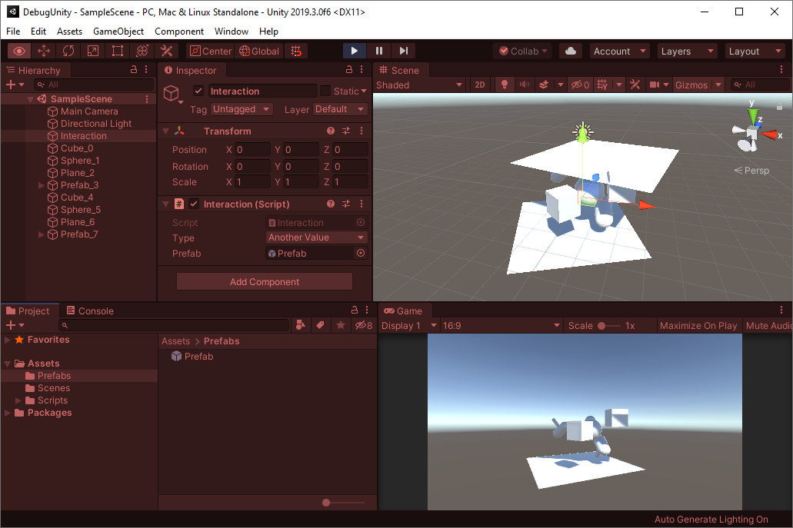

# Debug Unity: testes, bugs e debug

### Descrição

Uma pessoa criou o projeto **DebugUnity** tendo em mente as seguintes funcionalidades:

1. Ao executar o projeto, é possível usar as teclas `Q`, `W`, `E` e `R` para criar objetos em tempo de execução (`Q` = Cubo, `W` = Esfera, `E` = Plano e `R` = Prefab).
2. Cada objeto é criado em uma posição aleatória (entre -2.0 e +2.0 nos três eixos). Além da posição, cada objeto é criado da seguinte maneira:
	* Cubo: Fica rotacionando no eixo Y sem parar.
	* Esfera: Tem sua escala definida aleatoriamente, entre 50% e 150%.
	* Plano: Tem sua escala definida aleatoriamente, entre 50% e 100%, e é rotacionado uma única vez no eixo Y, em um ângulo aleatório entre 0º e 360º.
	* Prefab: Tem sua escala definida aleatoriamente, entre 50% e 100%, e é rotacionado uma única vez nos três eixos, em um ângulo aleatório entre 0º e 360º.
3. Cada objeto recebe um nome diferente, no formato `Tipo_N`, sendo:
	* `Tipo`: O tipo do objeto (`Cube`, `Sphere`, `Plane` ou `Prefab`)
	* `N`: A quantidade de objetos criados, começando por zero.
4. Ao executar o projeto e usar a seguinte sequência de teclas { `Q`, `W`, `E`, `R`, `Q`, `W`, `E`, `R` }, o resultado obtido é algo similar ao mostrado na figura abaixo.

5. Depois de ter executado o projeto e obtido o resultado da figura acima, a pessoa percebeu que deixou um `enum` comentado (`TypeEnum.FirstValue`), sendo que esse valor deve ficar acessível no código (ou seja, não deve ficar comentado).

Porém, o computador da pessoa deu problema enquanto ela estava fazendo alterações no projeto e, infelizmente, ela não estava usando um sistema de controle de versão.

O projeto desse repositório é o que a pessoa conseguiu recuperar.

### Objetivo

Seu objetivo é fazer um *fork* (bifurcação) do repositório, analisar o estado atual do projeto e alterá-lo de forma que o projeto volte a funcionar como descrito na página anterior.

Para todas as alterações realizadas, descreva o que foi feito (crie um arquivo **Changes.md** na raiz do repositório). Caso as alterações tenham sido realizadas para resolver bugs, descreva o problema e sua solução (explique como você resolveu o problema).

Consideração extra se você aplicar o método científico!